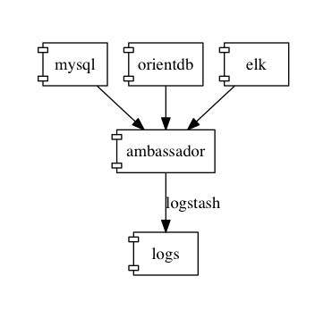
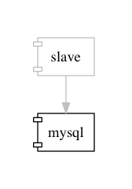
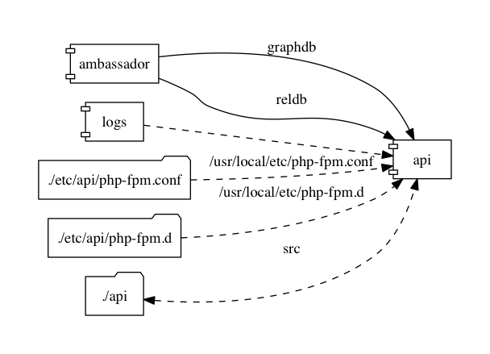
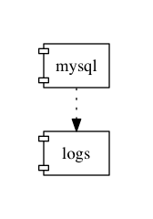
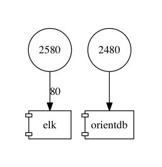
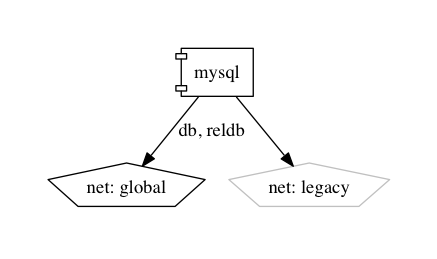
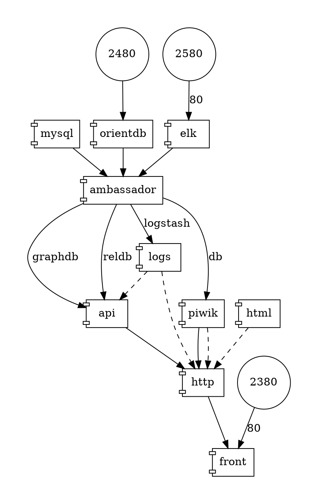
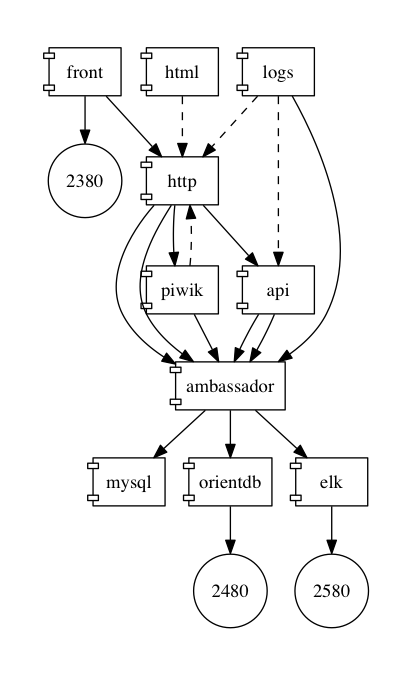
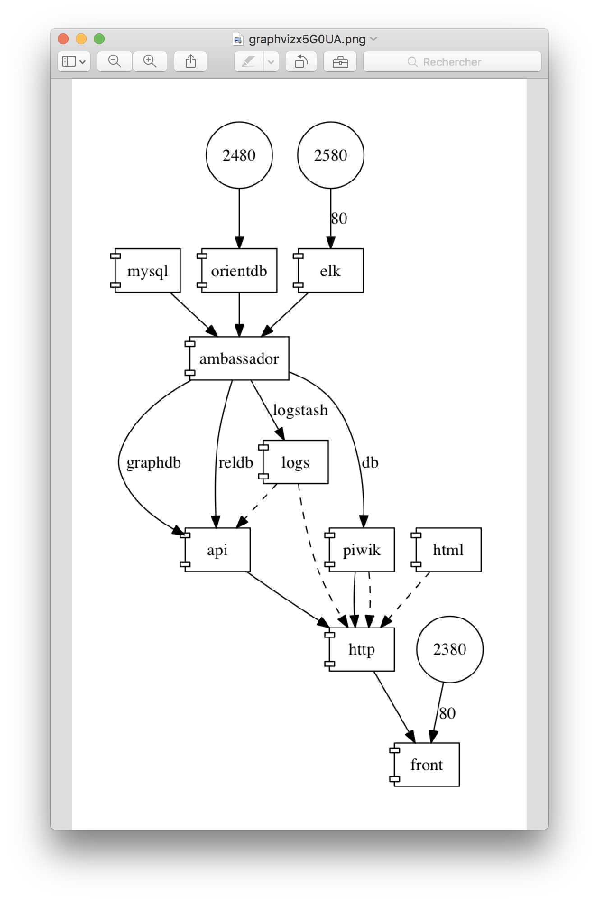

# `docker-compose-viz` 

[](http://isitmaintained.com/project/pmsipilot/docker-compose-viz "Average time to resolve an issue")
[](http://isitmaintained.com/project/pmsipilot/docker-compose-viz "Percentage of issues still open")
[](https://hub.docker.com/r/pmsipilot/docker-compose-viz/)
[](https://hub.docker.com/r/pmsipilot/docker-compose-viz/)

## How to use
     
### Docker

Considering the current working directory is where your `docker-compose.yml` file is located:

```bash
docker run --rm -it --name dcv -v $(pwd):/input pmsipilot/docker-compose-viz render -m image docker-compose.yml

# PowerShell
docker run --rm -it --name dcv -v ${pwd}:/input pmsipilot/docker-compose-viz render -m image docker-compose.yml
```

This will generate the `docker-compose.png` file in the current working directory.

### PHP

Before you start, make sure you have:

* [Composer](https://getcomposer.org/doc/00-intro.md#installation-linux-unix-osx) installed,
* [PHP 7.2](http://php.net/downloads.php#v7.2.32) (at least) installed,
* GraphViz installed (see below for a guide on how to install it)

```
git clone https://github.com/pmsipilot/docker-compose-viz.git

make vendor
# Or
composer install --prefer-dist 

bin/dcv
```

#### Install GraphViz

* On MacOS: `brew install graphviz`
* On Debian: `sudo apt-get install graphviz`

## Usage

```
Usage:
  render [options] [--] [<input-file>]

Arguments:
  input-file                         Path to a docker compose file [default: "./docker-compose.yml"]

Options:
      --override=OVERRIDE            Tag of the override file to use [default: "override"]
  -o, --output-file=OUTPUT-FILE      Path to a output file (Only for "dot" and "image" output format) [default: "./docker-compose.dot" or "./docker-compose.png"]
  -m, --output-format=OUTPUT-FORMAT  Output format (one of: "dot", "image", "display") [default: "display"]
      --only=ONLY                    Display a graph only for a given services (multiple values allowed)
  -f, --force                        Overwrites output file if it already exists
      --no-volumes                   Do not display volumes
  -r, --horizontal                   Display a horizontal graph
      --ignore-override              Ignore override file
```

## How to read the graph

### Links

Links (from `services.<service>.links`) are displayed as plain arrows pointing to the service that declares the link:



If we look at the link between `mysql` and `ambassador`, it reads as follow: "`mysql` is known as `mysql` in `ambassador`."
If we look at the link between `ambassador` and `logs`, it reads as follow: "`ambassador` is known as `logstash` in `logs`."

External links are displayed using the same shapes but are grayed:



### Volumes

Volumes (from `services.<service>.volumes_from`) are displayed as dashed arrows pointing to the service that uses the volumes:



If we look at the link between `logs` and `api`, it reads as follow: "`api` uses volumes from `logs`."

Volumes (from `services.<service>.volumes`) are displayed as folders with the host directory as label and are linked to the service that uses them dashed arrows.

If we look at the link between `./api` and `api`, it reads as follow: "the host directory `./api`is mounted as a read-write folder on `/src` in `api`." Bidirectional arrows mean the directory is writable from the container.

If we look at the link between `./etc/api/php-fpm.d` and `api`, it reads as follow: "the host directory `./etc/api/php-fpm.d`is mounted as a read-only folder on `/usr/local/etc/php-fpm.d` in `api`." Unidirectional arrows mean the directory is not writable from the container.

### Dependencies

Dependencies (from `services.<service>.depends_on`) are displayed as dotted arrows pointing to the service that declares the dependencies:



If we look at the link between `mysql` and `logs`, it reads as follow: "`mysql` depends on `logs`."

### Ports

Ports (from `services.<service>.ports`) are displayed as circle and are linked to containers using plain arrows pointing to the service that declares the ports:



If we look at the link between port `2480` and `orientdb`, it reads as follow: "traffic coming to host port `2480` will be routed to port `2480` of `orientdb`."
If we look at the link between port `2580` and `elk`, it reads as follow: "traffix coming to host port `2580` will be routed to port `80` of `elk`."

### Extends

Extended services (from `services.<service>.extends`) are displayed as components (just like normal services). The links between them and the extending services are 
displayed as inverted arrows:


If we look at the link between `mysql` and `db`, it reads as follow: "`mysql` extends  service `db`".

### Networks

Networks (from `networks.<network>`) are displayed as pentagons. The links between them and services are displayed as plain arrows pointing to the network:



If we look at the link between `mysql` and the `global` network, it reads as follow: "`mysql` is known as `mysql`, `db` and `reldb` in the `global` network.

The `legacy` network is an external so it's displayed as a grayed pentagone.

## Examples

### `dot` renderer



### `image` renderer



### `display` renderer



### Troubleshooting

#### Getting "failed to open stream: Permission denied"?

Make sure the target directory is writeable by the user in the Docker container.
Or create a writeable directory first. See [workaround #41](https://github.com/pmsipilot/docker-compose-viz/issues/41#issuecomment-483384999)

## License

The MIT License (MIT)
Copyright ® 2020 PMSIpilot
